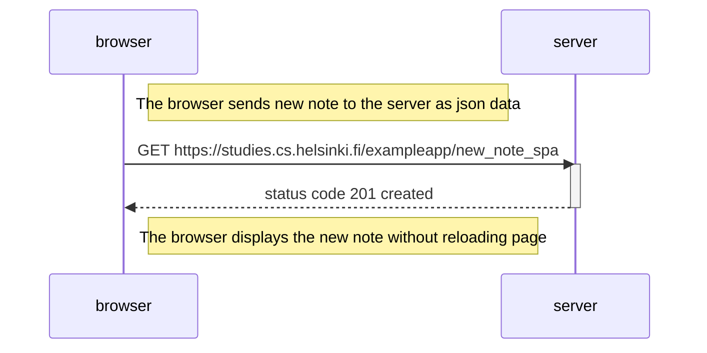

```mermaid
sequenceDiagram
    participant browser
    participant server

    Note right of browser: The browser sends new note to the server as json data
    browser->>server: GET https://studies.cs.helsinki.fi/exampleapp/new_note_spa
    activate server
    server-->>browser: status code 201 created
    deactivate server
    Note right of browser: The browser displays the new note without reloading page

```